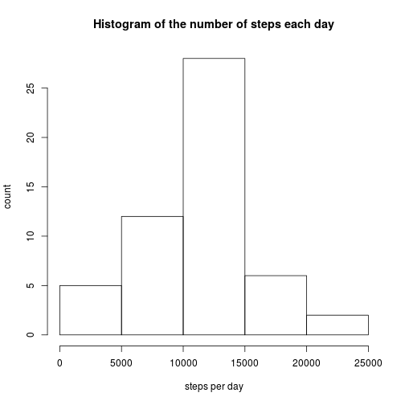
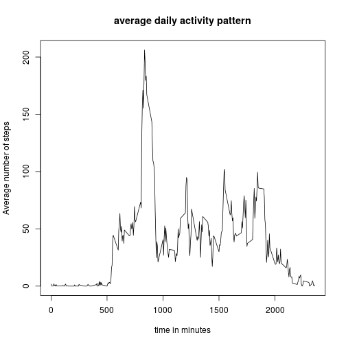
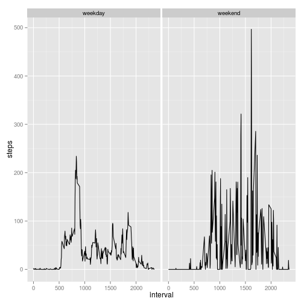

### Introduction

It is now possible to collect a large amount of data about personal
movement using activity monitoring devices such as a
[Fitbit](http://www.fitbit.com), [Nike
Fuelband](http://www.nike.com/us/en_us/c/nikeplus-fuelband), or
[Jawbone Up](https://jawbone.com/up). These type of devices are part of
the "quantified self" movement -- a group of enthusiasts who take
measurements about themselves regularly to improve their health, to
find patterns in their behavior, or because they are tech geeks. But
these data remain under-utilized both because the raw data are hard to
obtain and there is a lack of statistical methods and software for
processing and interpreting the data.

This report makes use of data from a personal activity monitoring
device. This device collects data at 5 minute intervals through out the
day. The data consists of two months of data from an anonymous
individual collected during the months of October and November, 2012
and include the number of steps taken in 5 minute intervals each day.

The goal of this report is the find the mean number of steps taken each day and visualize step patterns on week-days versus weekends

### Data

The data for this assignment can be downloaded from the course web
site:

* Dataset: [Activity monitoring data](https://d396qusza40orc.cloudfront.net/repdata%2Fdata%2Factivity.zip) [52K]

The variables included in this dataset are:

* **steps**: Number of steps taking in a 5-minute interval (missing
    values are coded as `NA`)

* **date**: The date on which the measurement was taken in YYYY-MM-DD
    format

* **interval**: Identifier for the 5-minute interval in which
    measurement was taken

The dataset is stored in a comma-separated-value (CSV) file and there
are a total of 17,568 observations in this
dataset.


### Loading and preprocessing the data
We removed all rows with missing values from the data set

```r
#Load and view the data
df = read.csv('./data/activity.csv')
```

```
## Warning in file(file, "rt"): cannot open file './data/activity.csv': No
## such file or directory
```

```
## Error in file(file, "rt"): cannot open the connection
```

```r
head(df)
```

```
##     steps       date interval day.type
## 289     0 2012-10-02        0  weekday
## 290     0 2012-10-02        5  weekday
## 291     0 2012-10-02       10  weekday
## 292     0 2012-10-02       15  weekday
## 293     0 2012-10-02       20  weekday
## 294     0 2012-10-02       25  weekday
```

```r
#Removing NA rows
df = df[!is.na(df),]
# convert data to Date type 
df$date = as.Date(df$date)
```
### What is mean total number of steps taken per day?
In order to find the total number of steps taken each day we group by the date and sum the number of steps. We then plot the distribution of the daily number of steps and report the mean and the median


```r
#Calculate the total number of steps taken per day
df_per_day = aggregate(steps ~ date, data=df, FUN=sum)
#Make a histogram of the total number of steps taken each da
hist(df_per_day$steps, breaks=6, 
     ylab='count', xlab='steps per day',
      main='Histogram of the number of steps each day')
```

 

```r
#Calculate and report the mean and median of the total number of steps taken per day
mean_steps = mean(df_per_day$steps) #mean number of steps each day
median_steps = median(df_per_day$steps) #median
mean_steps
```

```
## [1] 10766.19
```

```r
median_steps
```

```
## [1] 10765
```
We can a mean number of steps of 1766 and a median which is very close of 1765.

### What is the daily activity pattern?
We wish to explore the average daily activity pattern. In order to do so we take the mean across all intervals and plot a time series

```r
avg_per_int = aggregate(steps ~ interval, data=df, FUN=mean)
plot(avg_per_int, type='l', xlab='time in minutes', 
     ylab='Average number of steps', main='average daily activity pattern')
```

 

```r
# find the time at which the activity is maximum
avg_per_int$interval[which.max(avg_per_int$steps)]
```

```
## [1] 835
```
We clearly see a pattern. The first part of the day there is no activity (probably when the participants are sleeping) and the maximum activity is at 835 minutes.

### Are there differences in activity patterns between weekdays and weekends?
We explore whether there is a difference in the activity pattern on weekends versus weekdays in the trellis plot below.

```r
# make a new column indicating whether it is a weekday or weekend
df[, 'day.type'] = NA
df[weekdays(df_per_day$date) %in% c("Saturday","Sunday"), 
           'day.type'] = 'weekend'
df[!(weekdays(df$date) %in% c("Saturday","Sunday")), 
           'day.type'] = 'weekday'
df$day.type = as.factor(df$day.type)

#take the mean number of steps across the intervals and day-type
avg_per_int_daytype = aggregate(steps ~ interval+day.type, data=df, FUN=mean)

#plot
library(ggplot2)
p =ggplot(data = avg_per_int_daytype, aes(y=steps, x=interval)) + geom_line()
p + facet_wrap(~day.type)
```

 

We clearly see that the participants are alot more active in the weekends. 
